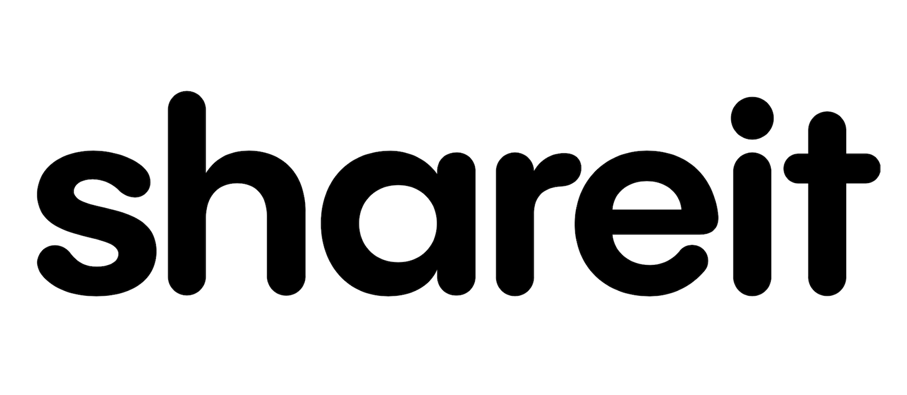

<h1 align="center">Item Sharing Platform</h1>

## Technologies Used

&nbsp;&nbsp;&nbsp;&nbsp;&nbsp;&nbsp;

&nbsp;&nbsp;&nbsp;&nbsp;&nbsp;&nbsp;

&nbsp;&nbsp;&nbsp;&nbsp;&nbsp;&nbsp;

&nbsp;&nbsp;&nbsp;&nbsp;&nbsp;&nbsp;

&nbsp;&nbsp;&nbsp;&nbsp;&nbsp;&nbsp;

&nbsp;&nbsp;&nbsp;&nbsp;&nbsp;&nbsp;

More info about the technologies can be found <a href="https://github.com/mamarmar/shareit/blob/main/README.md#technologies-used-extended">here</a>.

## Description
shareit is a full-stack [MERN](https://www.mongodb.com/languages/mern-stack-tutorial) web application that allows you to borrow and lend items within your community. Do you need something for a day? Just ask for it. Do you have something that someone else needs? Just offer it to them.

By buying less you do your part in reducing your ecological foorprint, in line with the first of [the '3 Rs' of waste management (Reduce, Reuse, Recycle)](https://en.wikipedia.org/wiki/Waste_management#Principles_of_waste_management).

## Technologies Used (Extended)

- [MongoDB](https://www.mongodb.com/)
   MongoDB Atlas is a cloud-based database service. This is where all our data is stored.
- [Express](https://github.com/nexus-js/ui)
   Express is a Node.js web application framework. It makes handling our data processing logic much easier.
- [React](https://reactjs.org/)
   React is a JavaScript library used to implement the front end.
- [Node.js](https://nodejs.org/en/)
   Node.js is a back end JavaScript runtime environment that allows us to develop our server-side logic using good old JavaScript.
- [MUI](https://mui.com/)
   Matierial UI components were used to achieve a clean and minimal design as well as responsiveness.
- [npm](https://github.com/npm/cli)
   Our beloved package manager.
- [EmailJS](https://www.emailjs.com/)
   With EmailJS emails can be sent directly through the app.

## Roadmap

### Currently Working On
- Bug fixes

### Future Plans

Some of the features to be implemented in the future are:

- Allow users to upload their own images (profile picture, offered item images, etc)
- Include a Google Map with a marker for every offered/requsted item

## Special Thanks To

- [Yasmeen Othman](https://github.com/YasmeenOthman), for her guidance and continuous support throughout this fascinating journey.
- All the students and the tutors at the [Social Hackers Academy](https://github.com/SocialHackersAcademy), for creating a nice little community of passionate people offering their best for each other.

